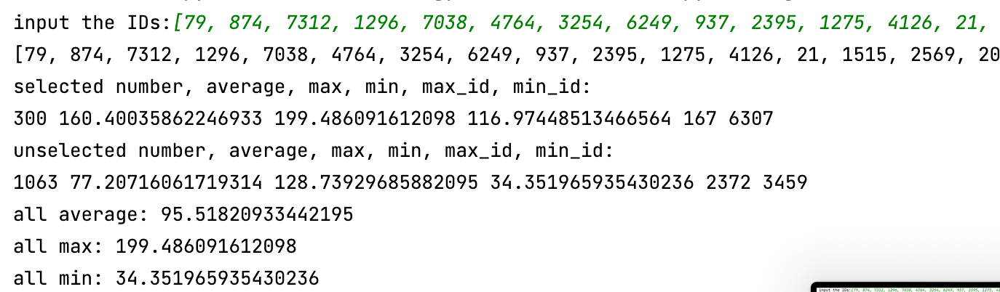

# The-Behavior-aware-Methodology-for-Crowd-Management_Vadere

This is the assistant code for thesis The-Behavior-aware-Methodology-for-Crowd-Management.
Because there are limitations in setting large-scale attributes (such as target or speed) in Vadere, we have designed a series of code to assist Vadere in achieving the experimental objectives. Since Vadere's input file is a JSON file in the Topography, we modify the JSON file of the Topography using Python.These codes are used to accomplish the following purposes:

- Change the speed of all individuals to one particular speed.
- Change the speed of randomly selected individuals.
- Change the speed of pre-selected individuals.
- Change the target of all individuals to one particular target.
- Change the target of all individuals but selected one to one particular target.
- Move all the individuals.
- Make all the individuals go to their closest target.
- Make all the individuals go to their closest target but the selected one.
- Calculate the time it takes for the last person to leave the scene from the start of the evacuation.
- Calculate the time from the start of the evacuation until the last person leaves this target.
- Calculate the escape time of one selected individual.
- Calculate the escape time of multiple selected individual.
- Visualize the results.

DEMO URL LINK:https://youtu.be/jApC8Nh8fM0

## Running this project(examples in the thesis)
The json files of 12 experiments in the thesis are preserved in this repository in the format of scene(number)_strategy(character)_json, and users can easily replicate the results through simple operations.
1. copy the json file to the Topography part of Vadere simulator
2. In the Data output, add files result.txt and result2.txt
3. change the Data Key of result.txt to EventtimePedestrianIdKey, and change the processors to '1'
4. change the Data Key of result2.txt to EventtimePedestrianIdKey, and change the processors to '2'
5. click "run selected scenarios" button
6. use [Multi_Individuals_Time.py](./Multi_Individuals_Time.py) to get the result. Copy and paste the id in [selected.json](./selected.json) as id input
7. use [Target_Finished_Time.py](./Target_Finished_Time.py) to get finish time of each target 
8. visualize the result by putting the data into [Visualization.py](./Visualization.py).

## Running this project(customized)

1. put the file of output file into [folder_path](./folder_path);
2. paste Topography data to pedestrian.json;
3. use [Change_All_Speed.py](./Change_All_Speed.py) to set speed range(1.5-1.6) for every individual([pedestrian.json](./pedestrian.json) will then be updated automatically);

4. use [Random_Selected_Change_Speed.py](./Random_Selected_Change_Speed.py) to randomly select 500 individuals as elderly and set their speed range to 1.0-1.3([selected.json](./selected.json) will automatically update the id and [pedestrian.json](./pedestrian.json) will automatically update the speed );
5. change the target of all the individuals to their closest target by running [To_Closest_Target.py](./To_Closest_Target.py);
6. copy and paste the new data in pedestrian.json to Topography in Vadere to run the experiments. Then use [Multi_Individuals_Time.py](./Multi_Individuals_Time.py) to get the result. Copy and paste the id in [selected.json](./selected.json) as id input;

7. get the results of mixed group. The finish time of each target could be looked up in [Target_Finished_Time.py](./Target_Finished_Time.py);
8. change the target of the elderly to target 1 and others to their closest target except target 1 by running [Go_Cloest_3_Targets.py](./Go_Cloest_3_Targets.py). Copy and paste the id in [selected.json](./selected.json) as id input. The target in [pedestrian.json](./pedestrian.json) will automatically be updated;
9. copy and paste the new data in pedestrian.json to Topography in Vadere to run the experiments. Then use [Multi_Individuals_Time.py](./Multi_Individuals_Time.py) to get the result. Copy and paste the id in [selected.json](./selected.json) as id input;
10. get the results of separate group. The finish time of each target could be looked up in [Target_Finished_Time.py](./Target_Finished_Time.py);
11. visualize the result by putting the data into [Visualization.py](./Visualization.py).

## Brief Explanation

- [pedestrian.json](./pedestrian.json) is used to store the Topography json file from Vadere.

- [selected.json](./selected.json) is used to store ids of individuals that are selected as elderly.

- [Change_All_Speed.py](./Change_All_Speed.py) can be used to change all the speed of individuals between a range.
  - `n` is the min speed.
  - `m` is the max speed.

- [Random_Selected_Change_Speed.py](./Random_Selected_Change_Speed.py) can be used to change the speed of randomly selected individuals.
  - `number` is the number of individual you want to change.
  - `n` is the min speed.
  - `m` is the max speed.

- [Intented_Selected_Change_Speed.py](./Intented_Selected_Change_Speed.py) can be used to change the speed of randomly selected individuals.
  - `id_list` is the id list of individual who you want to change the target(normally it is the id in [selected.json](./selected.json)).
  - `n` is the min speed.
  - `m` is the max speed.
  

- [Change_Target.py](./Change_Target.py) can be used to change the target of selected individuals to one particular target.
   - `id_list` is the id list of individual who you want to change the target.
   - `target` is the target you want these individuals to have.

- [Change_Target_inverse.py](./Change_Target_inverse.py) can be used to change the target of all individuals but selected to one particular target.
   - `id_list` is the id list of individual who you don't want to change the target(normally it is the id in [selected.json](./selected.json)).
   - `target` is the target you want all individuals but selected individuals to have.

- [To_Closest_Target.py](./To_Closest_Target.py) can be used to change the target of all individuals to their closest target.

- [Go_Cloest_3_Targets.py](./Go_Cloest_3_Targets.py) can be used to change the target of all individuals(but individuals in [selected.json](./selected.json)) to their closest target but the selected one.
  - the elderly will go to target 1.
  - other individuals will go to their closest target except target 1.

- [Move_All_Pedestrians.py](./Move_All_Pedestrians.py) can be used to move all the individuals.This file is used to transform a symmetric scene into an asymmetric scene, specifically by changing the initial positions of all individuals from the center to the top-left corner.

- [Total_Time.py](./Total_Time.py) can be used calculate the time from the start of the experiment to the last individual escape from the scene.

- [Multi_Individuals_Time.py](./Multi_Individuals_Time.py) can be used calculate the excavation time(average, max, min) of certain id or id list.
  -  `id_list` is the id list of individual who you want to add to calculate(normally it is the id in [selected.json](./selected.json)).
  - the output includes the average time, the max time and the min time.

  
- [Target_Finished_Time.py](./Target_Finished_Time.py) can be used to calculate the time from the start of the evacuation until the last person leaves this target. 
  - the results of all the targets involved will be printed.

- [Individual_Time.py](./Individual_Time.py) can be used to calculate the escape time of one selected individual.
  - `number` is the id of individual who you want to calculate the escape time.

- [Multi_Individuals_Time.py](./Multi_Individuals_Time.py) can be used to calculate the escape time of multiple selected individual.
  - `id_list` is the id list of individual who you want to add to calculate(normally it is the id in [selected.json](./selected.json)).

- [Visualization.py](./Visualization.py) can be used to visualize the results
  - bar named `separate` is used to visualize the results when one target is specially set for the elderly.
  - bar named `mixed` is used to visualize the results when no target is specially set for the elderly.